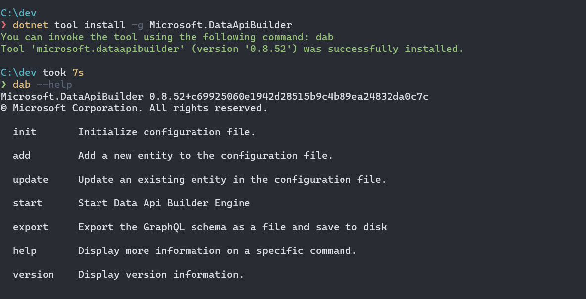

# Data Api Builder (Microsoft Open Source innovation)

- Low Code using a Generator | Less code | More time on Data and Business value   

- The source code is on GitHub: https://github.com/Azure/data-api-builder

- [Youtube | Quick API Endpoints Using Data API Builder](https://www.youtube.com/watch?v=XQRO_uoGhp4&t=218)

- https://learn.microsoft.com/en-us/azure/data-api-builder/overview-to-data-api-builder?tabs=azure-sql


## Install the Data API Builder CLI

```powershell
dotnet tool install -g Microsoft.DataApiBuilder

# verify the installation
dab --help
```




## POC | (Database model) SQLServer as Container

```bash
# This docker image is based on the official Microsoft SQL Server 2017 with data included from the AdventureWorksLT2017 database. 
docker run -d --name sqlserverWithData -e "ACCEPT_EULA=Y" -e "SA_PASSWORD=Djakp88t" -p 1433:1433 jalalhejazi/microservice_sqlserver:latest


# Create the desired database model using sqlcmd automation 
# Change ./setup_database.sql as needed or use your own sql file 
sqlcmd -S localhost,1433 -U sa -P Djakp88t -i ./setup_database.sql
sqlcmd -S localhost,1433 -U sa -P Djakp88t -Q "SELECT count(*) as [TestCount]  FROM [StudentDB].[dbo].[StudentDetails]"
```

## Now REST API automatic generated using Microsoft Data API Builder 

```bash
# ref: https://learn.microsoft.com/en-us/azure/data-api-builder/data-api-builder-cli

# Change your connectionstring as needed --> dab init auto generate dab_config.json 
dab init --database-type mssql --host-mode development --connection-string "Data Source=localhost;Initial Catalog=StudentDB;User ID=sa;Password=Djakp88t;Trust Server Certificate=True"

# --source.type of the database object. Must be one of: [table, view, stored-procedure]
dab add studentDetails --source dbo.StudentDetails --source.type table --permissions "anonymous:*"

# Done: Start Browsing REST API 
dab start

# Discovery REST API endpoint with swagger
# https://localhost:5001/swagger/index.html
# https://localhost:5001/api/studentDetails
# https://localhost:5001/graphql/

```

## What next 
- Evaluate how to use this tool in a real project and compare with dotnet ef scaffolding
- Evaluate the hosting options and the security options 
- Remove all the secrets from this readme.md file and use only environment variables 
- 

