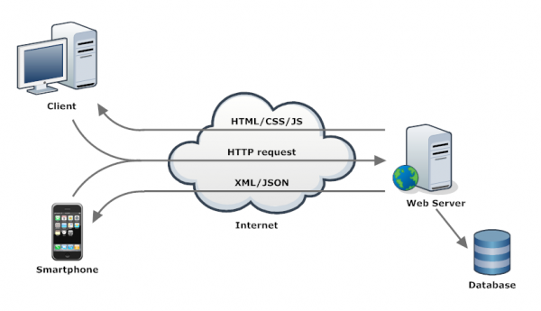

# REST API 

REST stands for Representational State Transfer. It is an architectural style for designing networked applications. REST uses a stateless, client-server communication model, which treats web services as resources that can be identified by their URLs. It is commonly used for web services and relies on standard HTTP methods such as GET, POST, PUT, and DELETE for interactions.

In RESTful systems, each URL is a representation of some resource. Clients interact with these resources by exchanging representations of the resource's state, typically in the form of JSON or XML documents.

REST was introduced and defined in 2000 by Roy Fielding in his doctoral dissertation. It has since become one of the most popular approaches for building scalable and robust web services.

## Richardson Maturity Model (from level 0 to 3) 
- https://en.wikipedia.org/wiki/Richardson_Maturity_Model
- http://martinfowler.com/articles/richardsonMaturityModel.html

Richardson Maturity Model, a concept by Leonard Richardson that describes the maturity level of a RESTful web service. The model outlines four levels of REST services, starting from Level 0, which is the use of HTTP as a transport system for remote interactions, to Level 3, which involves the use of hypermedia controls.

Here's a brief summary of each level:

| Level | Name                | Description                                                                                     |
|-------|---------------------|-------------------------------------------------------------------------------------------------|
| 0     | Plain old xml       | HTTP is used merely as a transport system for remote interactions.                              |
| 1     | Resources           | Introduces the concept of resources, where individual endpoints represent different entities.    |
| 2     | HTTP Verbs          | Makes use of HTTP verbs like GET, POST, PUT, and DELETE to perform CRUD operations on resources.|
| 3     | Hypermedia Controls | Uses hypermedia as the engine of application state (HATEOAS), allowing dynamic client navigation.|

The Richardson Maturity Model is often used to gauge how "RESTful" a web service is, and it provides a roadmap for improving the design of such services.

## SWOT Comparing (RESTful | REST) web service

| Criteria     | RESTful APIs                                       | REST APIs                                          |
|--------------|----------------------------------------------------|-----------------------------------------------------|
| **Strengths**|                                                    |                                                     |
|              | - Strict adherence to REST principles              | - Flexibility in implementation                     |
|              | - Easier to understand and maintain                | - Can accommodate non-RESTful operations           |
|              | - Better community support                         | - May offer quicker development                     |
|              | - More predictable behavior                        | - Broader range of use-cases                        |
| **Weaknesses**|                                                   |                                                     |
|              | - Requires strict adherence, less flexibility      | - Can become complex and harder to maintain         |
|              | - May take longer to develop                       | - May not fully utilize REST advantages             |
|              | - Less suitable for real-time applications         | - Inconsistent implementations can cause confusion  |
| **Opportunities**|                                                |                                                     |
|              | - Growing demand for standardized APIs             | - Can evolve into RESTful APIs as needed            |
|              | - Easier to scale and extend                       | - More adaptable to various types of data exchange  |
|              | - Better suited for public APIs                    | - Can be optimized for specific use-cases           |
| **Threats**  |                                                    |                                                     |
|              | - May become obsolete if not updated               | - Risk of becoming a "REST-ish" API                 |
|              | - Complexity can increase with extensions          | - May suffer from poor documentation                |
|              | - Stricter rules may limit some functionalities    | - Inconsistent quality across different APIs         |

 
 

## 6 API Architectures 

 

